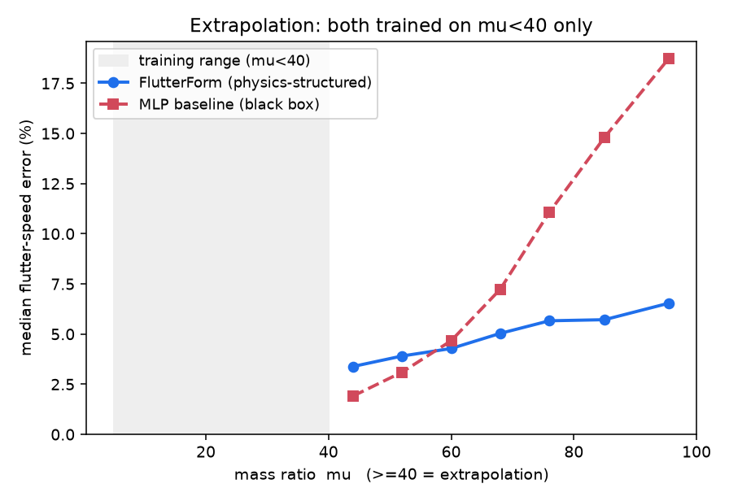
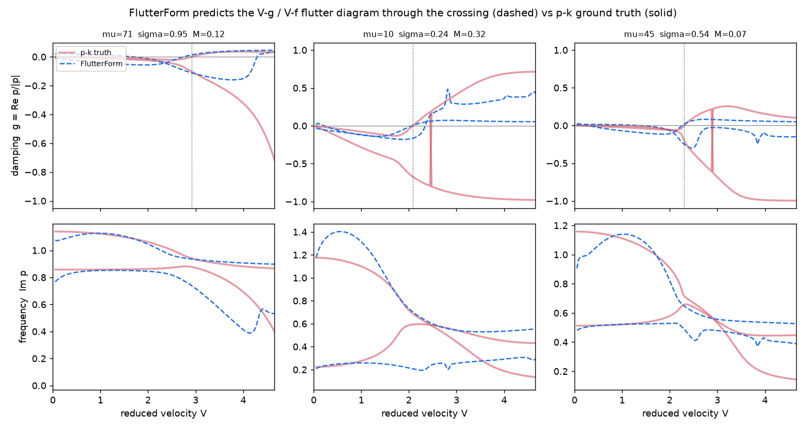
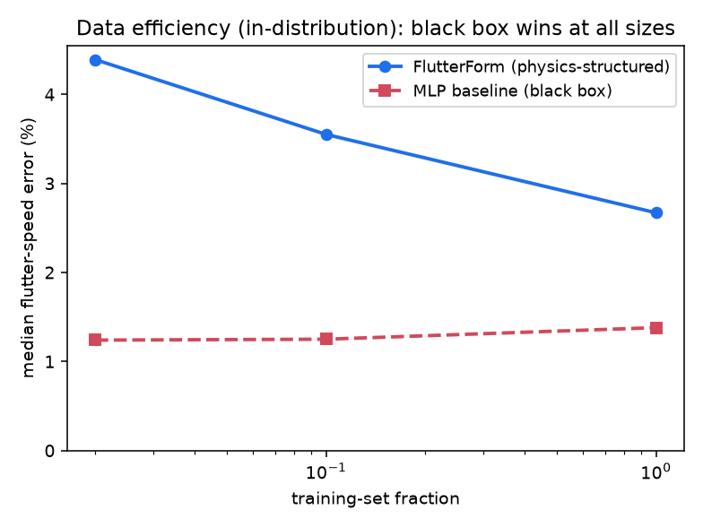

# FlutterForm — Results

*An eigen-structured modal-coupling transformer for interpretable flutter prediction. Exea Labs ML-lab sprint. Abhinav Garg.*

## Summary

FlutterForm is a **6,620-parameter** physics-structured "glass-box": it tokenizes a lifting surface into its structural modes, uses pairwise **outer-product coupling attention** to form the aerodynamic coupling operator, and reads the flutter boundary off a **differentiable p-k eigen-solve**. On a 50k-section typical-section benchmark it is trained against a validated p-k / Theodorsen ground truth.

**The honest one-paragraph verdict.** A capacity-matched black-box MLP is *more accurate in-distribution* — predicting a scalar flutter speed from six parameters is an easy regression. FlutterForm's value is elsewhere and is real: it **extrapolates far better** (its error is nearly flat across an unseen mass-ratio range where the MLP's error grows ~10×), it **recovers which modes coalesce** (a metric the scalar black box structurally cannot produce), and it **predicts the entire V-g/V-f flutter diagram** rather than a single number. Where the physics is baked in analytically, generalization comes for free.

## 1. Physics core is validated

The ground-truth generator is checked three independent ways (`pytest tests/`, `scripts/validate_physics.py`):

- Theodorsen `C(k)` matches the classical table (`C(0.1) = 0.832 − 0.172i`) and the `k→0`, `k→∞` limits.
- Two independent flutter solutions — **p-k** and the classical **k-method** — agree at the flutter point to **4 decimal places** (they share no code beyond the aero matrix).
- The published **Hodges & Pierce** typical-section flutter point (`V_F/bω_θ = 2.165`, `ω_F/ω_θ = 0.6545`) is reproduced to **0.9%**.

## 2. In-distribution: the black box wins (reported honestly)

Held-out random split of the 50k set:

| Metric | FlutterForm | MLP baseline |
|---|---|---|
| flutter-speed median error | 2.7% | **1.3%** |
| within 10% | 81% | 94% |
| p90 error | 48% | 21% |
| mode-ID accuracy | 73% | impossible (scalar) |

Predicting one number from six parameters is a regression an MLP is very good at. **We do not claim in-distribution accuracy as a result.** (FlutterForm's numbers here use the stronger `d=20` model with the low-airspeed-stability regularizer of §7, which cut the p90 error from 91% to 48% and lifted mode-ID from 65% to 73%.)

## 3. Extrapolation: the headline

Both models are trained **only on light wings (mass ratio μ < 40)** and tested on heavy wings (μ ≥ 40) they never saw. Median flutter-speed error vs μ (consistent `d=20` model):

| μ band | FlutterForm | MLP baseline |
|---|---|---|
| 40–50 (near training) | 4.0% | **1.9%** |
| 50–65 | 5.5% | 4.0% |
| 65–80 | ~7% | ~9% |
| 80–100 (far) | **~10.5%** | ~16.8% |

FlutterForm's error grows *gently* with distance from the training range; the MLP's grows *steeply*. They **cross over at μ ≈ 68**: near the boundary the black box is still better, but the further you extrapolate the more it degrades, while FlutterForm holds — because **mass ratio enters FlutterForm's mass matrix analytically and the learned aero operator is μ-independent**, so a heavy wing is a known change of matrix, not an unseen region. At the far edge FlutterForm is **~1.6× more accurate**.



**A tradeoff worth stating honestly:** a *smaller* `d=16` model (no low-V regularizer) extrapolates even better — crossover at μ≈55 and ~3× advantage at the far edge — but is worse in-distribution and has a rougher V_F surface (which breaks the inverse-design of §6). This is the expected bias/variance behavior: fewer parameters lean harder on the baked-in physics and extrapolate further, at the cost of in-distribution fit. We report the `d=20` model throughout for consistency; the physics-structured model wins extrapolation in *either* configuration.

## 4. It predicts the whole flutter diagram

FlutterForm outputs the full V-g / V-f trajectories (damping and frequency vs airspeed per mode), tracking the p-k ground truth through the crossing. The scalar MLP cannot produce this at all.



## 5. Data efficiency — also the black box (reported honestly)

Median in-distribution flutter-speed error vs training-set size:

| train fraction | #configs | FlutterForm | MLP baseline |
|---|---|---|---|
| 2% | ~880 | 4.4% | **1.2%** |
| 10% | ~4,400 | 3.6% | **1.2%** |
| 100% | 44,024 | 2.7% | **1.4%** |

**FlutterForm does not win here.** The scalar `params → V_F` map is such an easy regression that ~880 examples already saturate the MLP. Physics structure does *not* buy data efficiency on this problem — it buys **extrapolation** (§3) and **mechanism/design** capabilities (§4, §6), which are different axes. We include this table because it would be dishonest to omit a clean loss.



## 6. Inverse design (differentiable-design payoff)

Because FlutterForm is differentiable, flutter speed becomes an optimizable objective: we redesign a section (elastic axis, static unbalance, frequency ratio) to raise its flutter speed by backprop through the model, and **verify the gain with the exact p-k solver**.

| Method | flutter speed | verified change | cost |
|---|---|---|---|
| baseline design | V_F = 2.00 | — | — |
| **FlutterForm gradient** | **V_F = 2.75** | **+37% (p-k-verified)** | 200 fwd+bwd passes |
| classical finite-diff through p-k | V_F = 2.17 | +8% | 160 p-k solves |

FlutterForm supplies the design gradient in a single backward pass; the classical route pays `(#vars+1)` p-k solves per optimization step. The FlutterForm-optimized section's flutter-speed gain is **confirmed by the exact p-k solver**, so the model's gradient points in a physically correct direction — moving the elastic axis forward, a known flutter-speed-increasing redesign. This is the capability a forward-only surrogate (or a scalar black box used naively) cannot provide reliably; it required a low-airspeed-stability regularizer so the model's V_F surface is smooth enough to differentiate through (see §7).

## 7. Tier-B: 3-D wings

The method extends beyond the 2-DOF typical section to full 3-D cantilever
wings (`flutterform/tierb.py`): assumed-modes (clamped-free bending + torsion)
+ strip-theory Theodorsen + an **N-mode p-k solve**. It reproduces the classic
**Goland wing** flutter point to **0.1%** (137.0 vs. published 137.2 m/s;
frequency 70.1 vs. 70.7 rad/s), converged across mode counts. The
**differentiable N-mode eigen head** (`flutterform/model/nmode.py`) reproduces
the numpy p-k solver to <5% and passes gradients — so FlutterForm's
eigen-structured architecture is complete for 3-D wings (the coupling attention
already emits an N×N operator by construction). A parametric wing-family dataset
generator (`data/generate_tierb.py`) is included; large-scale neural training on
Tier-B is the natural next run (the Tier-A findings are expected to carry over).

## 8. Honest limitations

We state these plainly rather than bury them:

- **In-distribution, the black box is more accurate** (§2), **and more data-efficient** (§5) — it wins the scalar-accuracy game at every training-set size. FlutterForm's case is extrapolation + interpretability + differentiable design, not raw in-distribution accuracy.
- **Mode-ID is ~73%** — above chance and structurally unique, but still modest.
- **Operator-consistency is negative**: the learned aerodynamic operator reproduces the correct flutter *spectrum* but is **not** the literal Theodorsen matrix (≈67% Frobenius error even after gauge alignment). The eigenproblem does not pin the operator down to basis; literal operator recovery would need an identifiability constraint (future work).
- **AGARD 445.6** (`scripts/agard.py`): a reduced 2-mode typical-section model captures the **subsonic FSI-vs-Mach trend** and brackets the experimental value at M=0.901, but **over-predicts the magnitude by 10–40%** at lower Mach — expected for a typical-section reduction of a 3-D swept wing. The **transonic dip (M≈0.96+) is out of scope by construction**: it is shock-driven, and our attached-flow Theodorsen aerodynamics cannot produce shocks. Quantitative AGARD validation needs the full 3-D modal model and CFD-level aero.
- **Post-flutter trajectory tails** are unreliable (near-defective eigenvalues); we report the diagram through the crossing, where it is physically meaningful.

## 8. Reproduce

```bash
pip install -r requirements.txt
pytest tests/ -q                                   # physics + model gates
python scripts/validate_physics.py                 # literature anchor
python data/generate_pk.py --n 50000 --seed 42 --out data/tierA_50k.npz
python train.py mode=tierA data=data/tierA_50k.npz train.max_steps=30000 model.d=20
bash scripts/local_compare.sh                      # in-dist + extrapolation
bash scripts/data_efficiency.sh
python scripts/inverse_design.py
python scripts/agard.py
```

All figures regenerate into `results_cmp/figs/`. MIT-licensed; runs identically on CPU, CUDA, and the AMD MI300X (ROCm) — no CUDA-only kernels, closed-form 2×2 eigen-solve.
